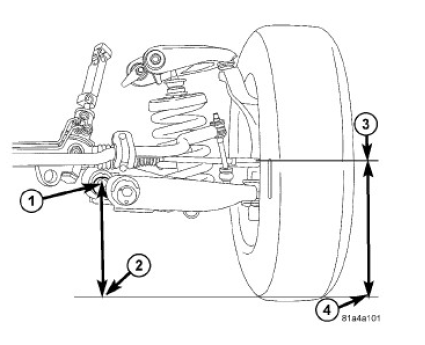
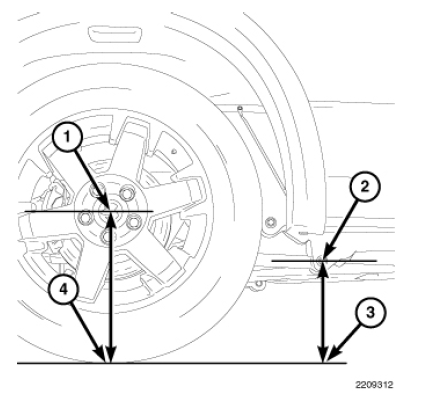

#########
RAM
#########

.. note:: This is *NOT A FULL LIST* of features available for modification, rather a colletion of more complex, vehicle-specific settings. For a complete list of features go to the JScan app and use demo mode connection.

.. attention:: In RAM DS, and possibly other models, after disabling or the TPMS or changing the thresholds you need to re-initialize Radio Frequency Hub, which requires vehicle PIN. See the steps below.

**************
General info
**************

Disabling the TPMS System / Changing thresholds
================================================

1) Disable TPMS Premium (Instrument Cluster) or/and TPMS Base OR set new thresholds

2) Go to Adaptations > Radio Frequency Hub - adaptation settings. From there:

3) Read vehicle PIN

4) Run Radio Frequency Hub Replace Procedure

5) Open !Restart All ECUs and from the drop-down choose "Instrument Cluster - Power On Restart" and tap GO.

6) Once completed, turn the car off completely

7) Close the door, wait a minute or two, open the door

8) Done: start the car, TPMS should be gone

.. note:: RAM DT will not allow a threshold lower than 25 PSI.

EU Lights Conversion
====================

1) Rear Lights Combined -> Deactivated

2) Rear Turn Lamps Output Present -> Activated 

3) Add two wires to BCM Pin 42 and 3 

4) Check turn signals either add new bulbs for turn signals or change lights do whaterver you want.

.. note:: In RAM DT if your lights switch doesn't work as expected, you may need to change the Country Code setting to Europe. Please note that changing this setting on other models usually triggers a "Vehicle Configuratiuon Mismatch" error, so if that's the case, revert the setting to the original value.

Disabling Engine Start-Stop
===========================

See `ESS`_ - Engine Start/Stop System in Wrangler JL section

TRX Suspension Rebound Reset & Height Sensor Calibration
======================================================== 

For the Ram 1500 TRX, JScan provides two sequential service functions to recalibrate the suspension. These must be performed in the correct order

Engine off, vehicle on level groud, ignition in RUN position.

1) PCM – TRX Suspension Rebound Reset: With the vehicle lifted and all wheels off the ground (suspension fully unloaded), run this service function

2) ADCM – Height Sensor Calibration: Lower the truck back to the ground at normal ride height, then run this calibration routine. This ensures the suspension height sensors are calibrated under normal load conditions.

3) After both routines are complete, clear trouble codes on all modules, cycle ignition, and verify proper operation of the suspension system.

Make sure to perform both routines in this order and under the specified conditions to properly reset and calibrate the TRX’s suspension.

All data related to the suspension system can be found in the ADCM module.

 .. image:: ../img/trx/ram_trx_in_air.jpg
  :width: 400px

 .. image:: ../img/trx/ram_trx_adcm_dtc.jpg
  :width: 200px

 .. image:: ../img/trx/adcm_dtc_jump.jpg
  :width: 200px

Tire Size Change
================

.. note:: RAM DT 2020+ vehicles have a factory maximum tire size limit of 35", above which Park Sense will be disabled and throwing errors. There is currently no way to bypass or override it.

In newer RAM DS vehicles:
 
 - Change the tire size as usual
 - Turn the key to OFF
 - Turn the Key to RUN again (don't start the engine)
 - Connect and run ABS Static Init 

Failing to do that will result in an ABS error.

***********
RAM DT
***********

The DASM calibration procedure for RAM DT
=========================================

It is required when the:

- DASM has been replaced
- The DASM has been reinstalled
- Tire diameter has been changed
- There are errors (DTCs): Calibration not learned (C008F-00) or Sensor Adjustment Required (C14A4-00)

The procedure:

1. Read the vertical angle by holding the inclinometer against the cooling ribs on the back of the DASM. Use an e5 Torx to adjust the adjustment screw. The adjustment specification is: -1 +/- 0.2 degree from vertical.

2. After completing the alignment, connect to the vehicle.
3. Select the Adaptation section and then  the Vehicle Maintenance group.
4. Run the DASM - Sensor Calibration Init- BETA procedure and follow the on screen prompts to complete DASM calibration.

*************
RAM 1500 (DS)
*************

Air Suspension Calibration
==========================

The calibration needs to be done with the vehicle on a flat, level surface. The tires should be standard size and standard pressure (reference measurements are for default wheels).

The air ride must be set to normal ride height.

Front
-------

1. On each side of the vehicle, measure the distance from the center of the rear lower control arm bolt (1) to the ground (2).
Record the measurement. Next measure the distance from the spindle center (3) to the ground (4). Record the measurement.
2. Subtract the control arm bolt to fl oor measurement from the wheel to floor measurement to calculate the ride height. (wheel - control arm = ride height).

Rear
---------

1. On each side of the vehicle, measure the distance from the center of the lower control arm forward bolt (2) to the ground (3).
Record the measurement. Next measure the distance from the center of the rear wheel (1) to the ground (4). Record the measurement.
2. Subtract the control arm bolt to fl oor measurement from the wheel to floor measurement to calculate the ride height. (wheel - control arm = ride height).

Ride Height Specifications
--------------------------

See the table below:

+---------------------------------------+------------+---------------+-------------+
| Model                                 | Wheelbase  | Front Height  | Rear Height |
+=======================================+============+===============+=============+
| 1500 4x2 17" tire                     | 120”       | 55mm +/-10mm  | 83mm +/-10mm|
+---------------------------------------+------------+---------------+-------------+
| 1500 4x2 17" tire                     | 140”, 149” | 55mm +/-10mm  | 81mm +/-10mm|
+---------------------------------------+------------+---------------+-------------+
| 1500 4x2 17" tire, TRX/Outdoorsman    | 120”       | 44mm +/-10mm  | 81mm +/-10mm|
+---------------------------------------+------------+---------------+-------------+
| 1500 4x2 17" tire, TRX/Outdoorsman    | 140”, 149” | 44mm +/-10mm  | 79mm +/-10mm|
+---------------------------------------+------------+---------------+-------------+
| 1500 4x2 with 20"                     | 120”       | 44mm +/-10mm  | 81mm +/-10mm|
+---------------------------------------+------------+---------------+-------------+
| 1500 4x2 with 20"                     | 140”, 149” | 44mm +/-10mm  | 78mm +/-10mm|
+---------------------------------------+------------+---------------+-------------+
| 1500 4x4                              | 120”       | 72mm +/-10mm  | 69mm +/-10mm|
+---------------------------------------+------------+---------------+-------------+
| 1500 4x4                              | 140”, 149” | 72mm +/-10mm  | 68mm +/-10mm|
+---------------------------------------+------------+---------------+-------------+
| 1500 4x4 TRX/Outdoorsman              | 120”       | 54mm +/-10mm  | 57mm +/-10mm|
+---------------------------------------+------------+---------------+-------------+
| 1500 4x4 TRX/Outdoorsman              | 140”, 149” | 54mm +/-10mm  | 56mm +/-10mm|
+---------------------------------------+------------+---------------+-------------+
| 1500 4x4 Rebel                        | 140”       | 60mm +/-10mm  | 54mm +/-10mm|
+---------------------------------------+------------+---------------+-------------+
| 1500 Air Susp. (Normal Ride Height)   | 140”, 149” | 83mm +/-10mm  | 79mm +/-10mm|
+---------------------------------------+------------+---------------+-------------+
| 1500 Air (Aero Mode)                  | 140”, 149” | 98mm +/-10mm  | 94mm +/-10mm|
+---------------------------------------+------------+---------------+-------------+

Curb Height Measurement
=======================

TBC...

.. _troubleshooting: https://jscan-docs.readthedocs.io/en/latest/general/troubleshooting.html
.. _Connect: https://jscan-docs.readthedocs.io/en/latest/general/getting_started.html#connecting
.. _ESS: https://jscan-docs.readthedocs.io/en/latest/jeep/jeep.html#ess-engine-start-stop-system