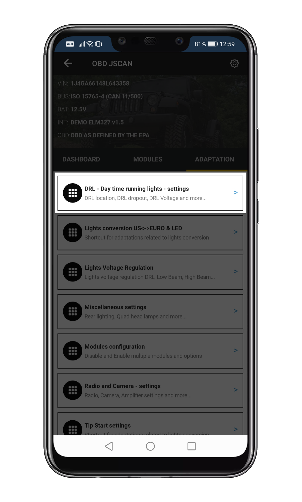
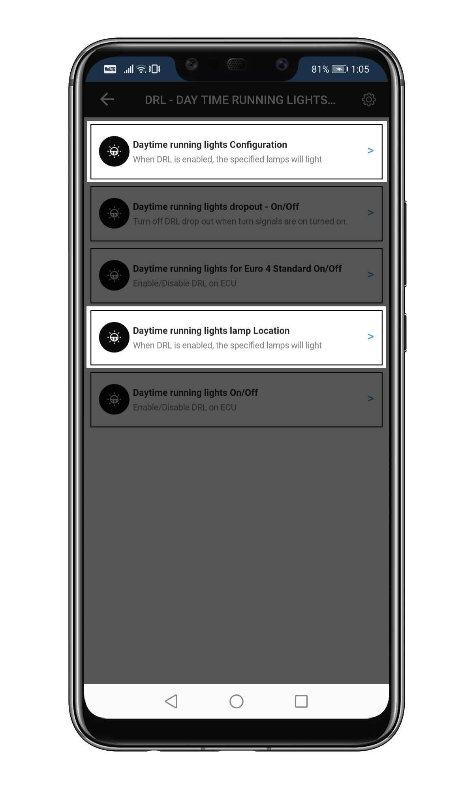

############################
General (START HERE)
############################

Adaptation section of the app is where you can make permanent (in most cases) changes to your vehicle configuration. Below you will find a step-by-step guide for some of the most common adaptations. These steps are the same for most vehicles.

.. note:: Adaptations are permanent.

***********************************
TPMS - Tire Pressure Monitor System
***********************************

There are two types of the TPMS: Standard and Premium. They both monitor tire pressure, but the premium version is capable of displaying more details, like current pressure on the EVIC (the electronic display in the instrument cluster).
The basic TPMS version was installed up to around 2011 in Wrangler JK, and most other vehicles past 2012 have the premium variant.

.. note:: TPMS is slow to respond to changes. It has it's own cache and can remember multiple settings. Either be patient, or reset the TPMS after applying changes - see details below.

Disabling TPMS
==============

That's the most basic change. If you want to disable the system completely it is advisable (though not necessary) that you have a proper tire pressure before you begin, i.e. no warning is up.

1. `Connect`_ to your vehicle
2. Open Adaptation
3. Open TPMS settings
4. Set the following, if present (these options' naming varies from vehicle to vehicle):

	- TPMS On/Off: *deactivated*
	- TPMS Premium On/Off: *deactivated*
	- Base TPMS system present On/Off: *deactivated*
	- TPMS System present On/Off: *deactivated*
	- Premium TPMS System present On/Off: *deactivated*

5. Don't worry if deactivating some of these does not work. This only means that the setting is present in the vehicle software, but this particular model doesn't use it.
6. Reset the TPMS. On most vehicles disconnecting the battery for a few minutes resets the TPMS, hower some newer vehicles have others systems relying on a constant power supply, so instead you can use **!Restart all ecus** option (usually available in Miscellaneous Settings section).

Changing TPMS thresholds
========================

This is a simple change, and again - it is highly advisable to not have any TPMS warnings active.

1. `Connect`_ to your vehicle
2. Open Adaptation
3. Open TPMS settings
4. Set TPMS thresholds in the following:

	- TPMS Threshold: for vehicles equipped with the basic version
	- TPMS Threshold - EVIC version: well... yes, for vehicles with the premium version
	- Light Load Inflation Pressure Front / Rear Tire: for vehicles that have a load sensor (Gladiator, RAM trucks). This value is used as the **minimum** pressure when the **vehicle is lightly loaded**
	- Max Load Inflation Pressure Front / Rear Tire: for vehicles that have a load sensor (Gladiator, RAM trucks). This value is used as the **minimum** pressure when the **vehicle is fully loaded**

5. Reset the TPMS. On most vehicles disconnecting the battery for a few minutes resets the TPMS, hower some newer vehicles have others systems relying on a constant power supply, so instead you can use **!Restart all ecus** option (usually available in Miscellaneous Settings section).

***********************************
Tire Size change
***********************************

Changing the tire size works the same in all vehicles.

.. attention:: **Make sure your engine is NOT RUNNING**

1. `Connect`_ to your vehicle
2. Open Adaptation
3. Open Tire & Axle settings.
4. Set Tire Size:
	
	- Choose a value from the drop-down list. It represents a tire *diameter* in inches.

	.. note:: If you pick a value that matches your tire size exaclty, your speedometer will be showing a higher reading than your GPS. That's normal - your factory wheels with factory settings worked the same. Blame the law-makers (At least in the EU). We recommend setting a value that is about 0.5 inch smaller than your actual tire size.

	- If you enabled it in App & Adapter settings, you will have manual input availabe. This however is wheel **circumference** in mm. Not recommended.
	- With manual input enabled you migth get an error when trying to set a value from a drop-down. In that case, disable manual input.

5. Disconnect, restart your vehicle. No ECU reset required.

Notes:
======

Some vehicles (especially the more "civilian" ones) have a max tire size value they can handle. You can set a higher one, but the ABS module will throw a warning on your dash. Decrease the tire size.

If you have any errors after setting the tire size (including because of the issue above):

1. `Connect`_ to your vehicle
2. Run Advanced Scan
3. Clear the codes
4. Fix the tire size setting
5. Restart the vehicle and see if the problem is fixed

**********************************
DRL - Daytime Running Lights setup
**********************************

A daytime running lamp (DRL, also daytime running light) is an automotive lighting on the front of a roadgoing vehicle, automatically switched on when the vehicle’s handbrake has been pulled down and is in drive, emitting white, yellow, or amber light. Their job is not to help the driver see the road but to help other road users see the vehicle.

.. important:: * When you change DRL settings Engine should be OFF and ignition set to RUN 

	* When you try to test DRL start car and release emergency brake and put your gearbox in to Drive.  On Manual gearbox you only need to release emergency brake. 

DRL Configuration & Customization
=================================

Slide to adaptation section and locate DRL – Day time running lights – settings

Now we have to set up DRL lights – lets start with Daytime Running Lights Configuration & Daytime Running Lights Location

First start with Daytime Running Lights – Configuration. Choose Canada DRL and update ECU.

.. image:: ../img/DRL-Configuration.png
	:width: 200 px	

Now, it’s time to set Day Time Running Lights Location – start with Low Beam and update ECU.

.. image :: ../img/DRL-Location.png
	:width: 200 px	

Test your lights
================
Start the car and release emergency brake put your gearbox in to Drive “D".  On Manual gearbox just release emergency brake. 

Troubleshooting DRLs
====================

Check your Daytime running lights On/Off, this option should be set to Active

.. image :: ../img/DRL-OnOff.png
	:width: 200 px	

Check DRL Voltage Regulation Left & Right to make sure there is power set to:

	- 7.0V for classic bulbs if you want them to shine at 50% power
	- 13.2V for LEDs (or if you want full power from regular bulbs)

Those settings are available under Lights Voltage Regulation

.. image :: ../img/DRL-Voltage.png
	:width: 200 px	

.. _Connect: https://jscan-docs.readthedocs.io/en/latest/general/getting_started.html#connecting

