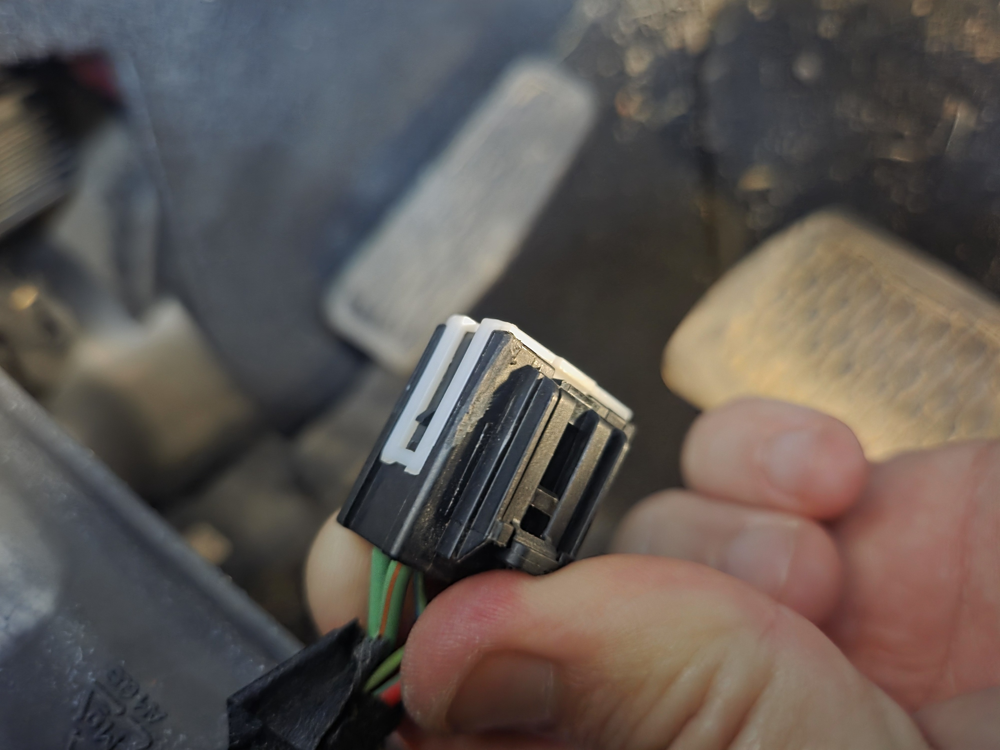
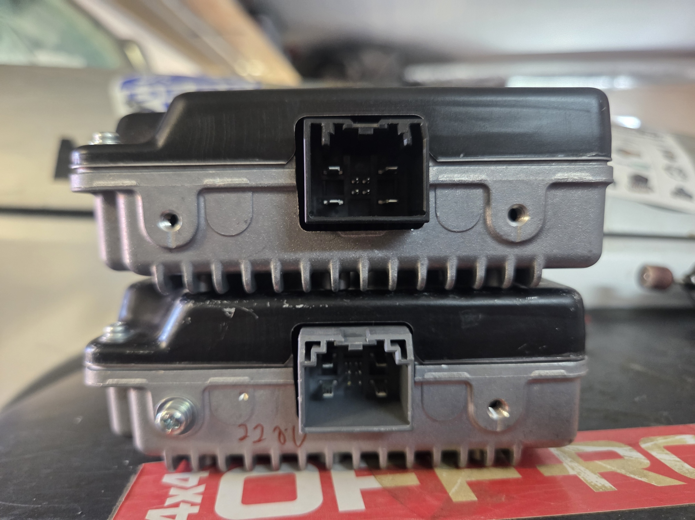
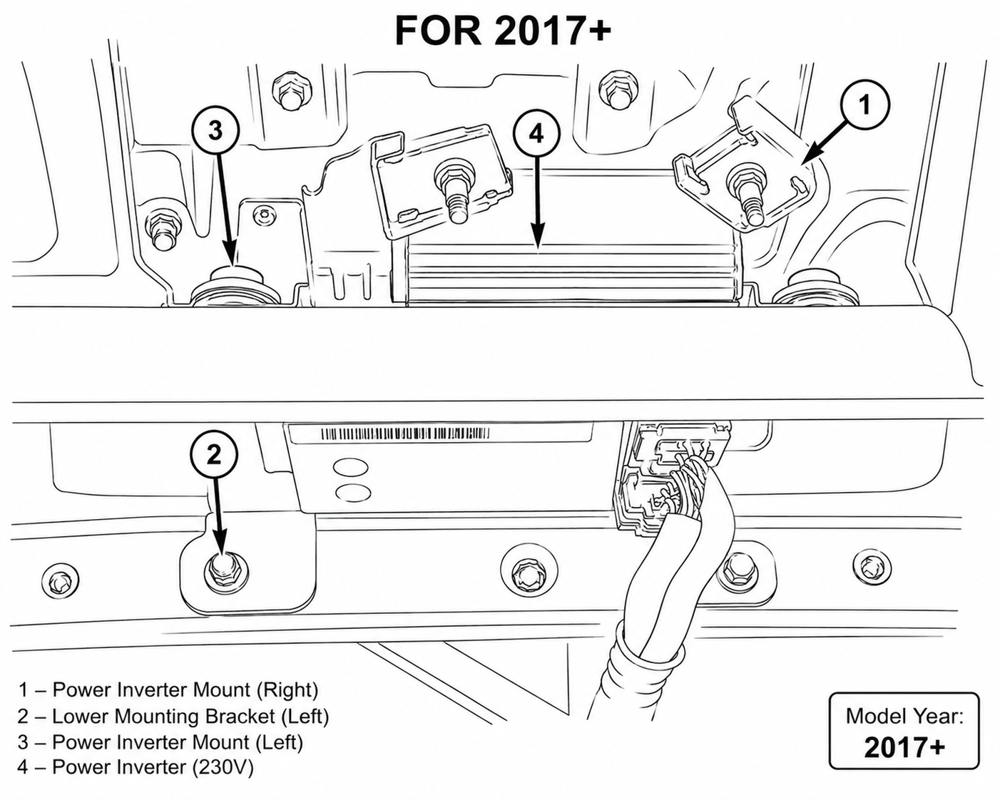
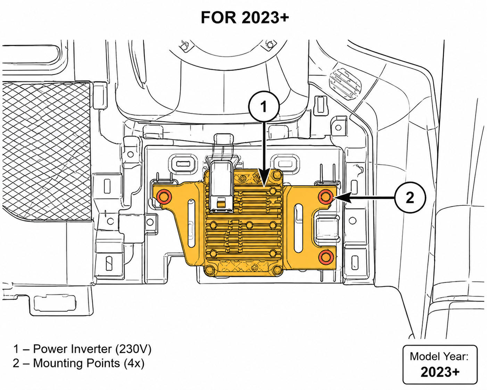
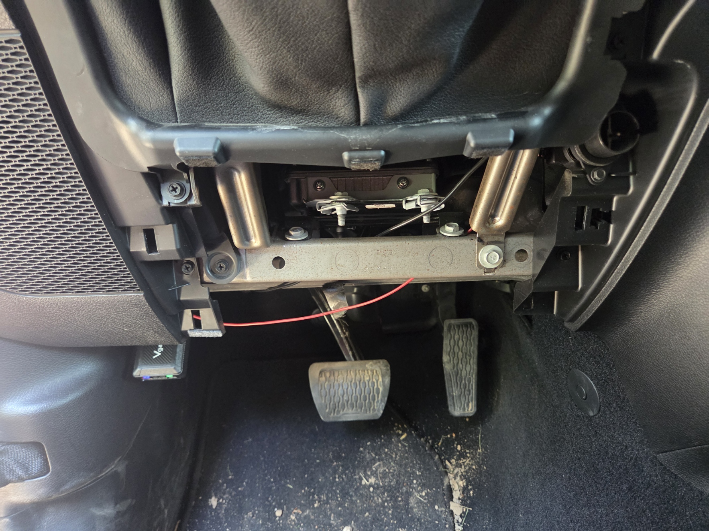

115V to 230V Power Inverter Conversion JL/JT/4XE and more
=========================================================

This procedure describes the replacement of the factory US-specification
115V AC power inverter with the European 230V AC version.

The US and EU inverters use the same electrical connectors and mounting
points. No BCM, PCM, or vehicle configuration changes are required.

.. note::

   This is a hardware-only modification. No coding or programming is required.

Overview
--------

Vehicles equipped with a factory AC power outlet use a dedicated inverter
module that converts vehicle DC voltage into AC power.

US specification vehicles are equipped with a 115V inverter, while European
vehicles use a 230V inverter.

To obtain a functional 230V outlet, the US inverter must be replaced with
the corresponding European version.

Connector Modification
----------------------

The vehicle-side connector may require a minor modification before it can be
connected to the European inverter.

The side plastic guides on the vehicle harness connector may prevent proper
engagement with the inverter connector. If necessary, carefully trim or file
the side plastic tabs until the connector can be fully inserted and locked
into place.

.. warning::

   Remove only the minimum amount of material required for proper fitment.
   Excessive trimming may affect connector retention and locking performance.

After modification, verify that:

* the connector is fully seated,
* the locking tab engages correctly,
* the connector cannot be removed without releasing the lock,
* no terminals, seals, or wires have been damaged.

.. note::

   This modification affects only the plastic housing of the vehicle-side
   connector. No wiring changes, terminal replacements, or vehicle coding
   are required.

Required Parts
--------------

Select the inverter according to the vehicle model year.

Power Inverter
~~~~~~~~~~~~~~

.. list-table::
   :widths: 25 35 40
   :header-rows: 1

   * - Model Years
     - Part Number
     - Description
   * - 2018–2021
     - 68349353AA
     - 230V AC power inverter
   * - 2022+
     - 68454720AB
     - 230V AC power inverter

Rear AC Outlet
~~~~~~~~~~~~~~

If required, install the European AC outlet assembly:

.. list-table::
   :widths: 40 60
   :header-rows: 1

   * - Part Number
     - Description
   * - 68347435AA
     - Rear console AC outlet assembly

.. note::

   The electrical connectors are identical between US and EU versions.
   Only the inverter and outlet hardware differ.

Inverter Location
-----------------

The inverter module is located behind the dashboard, near the instrument
cluster and steering column area.

Access to the inverter typically requires removal of dashboard trim panels.

   Typical inverter location behind the dashboard near the steering column.

   Typical inverter location behind the dashboard near the steering column.

Replacement Procedure
---------------------

#. Turn the ignition off.
#. Disconnect the negative battery terminal.
#. Remove the required dashboard trim panels.
#. Locate the inverter module.
#. Disconnect all electrical connectors.
#. Remove the inverter mounting fasteners.
#. Remove the US-specification inverter.
#. Install the European 230V inverter.
#. Reconnect all electrical connectors.
#. Reinstall dashboard components.
#. Reconnect the battery.

Verification
------------

After installation:

#. Start the vehicle.
#. Enable the AC power outlet according to the owner's manual.
#. Verify that the outlet indicator operates normally.
#. Connect a suitable 230V device and confirm proper operation.

No Programming Required
-----------------------

Unlike many vehicle feature retrofits, this conversion does not require:

The vehicle automatically operates the replacement inverter through the
existing wiring and control circuits.

Troubleshooting
---------------

Outlet Does Not Provide Power
~~~~~~~~~~~~~~~~~~~~~~~~~~~~~

Check the following:

* Inverter connectors are fully seated.
* The inverter matches the vehicle model year.
* Vehicle battery voltage is within specification.
* All inverter fuses are intact.
* The outlet assembly is compatible with the installed inverter.

Outlet Provides Incorrect Voltage
~~~~~~~~~~~~~~~~~~~~~~~~~~~~~~~~~

Verify that a European 230V inverter has been installed. A US-specification
115V inverter will continue to output approximately 115V AC regardless of
the outlet type installed.

Summary
-------

Converting the factory AC outlet system from 115V to 230V requires only
replacement of the inverter module and, if desired, the outlet assembly.
The wiring, connectors, and vehicle configuration remain unchanged, and
no programming or coding is required.