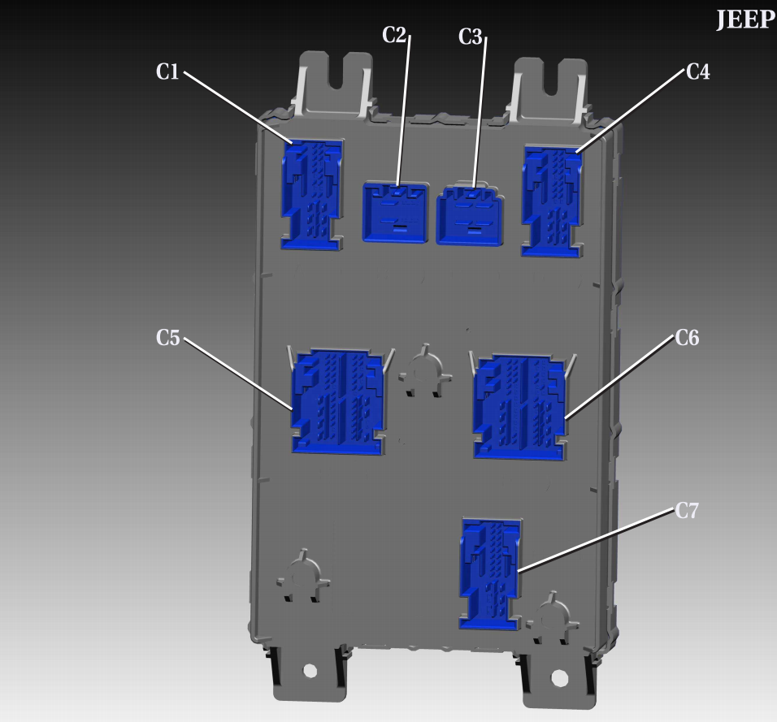
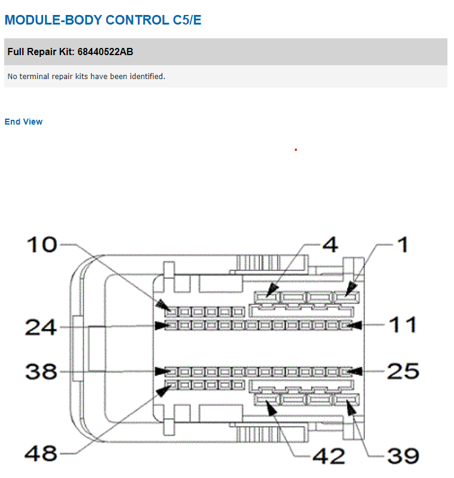
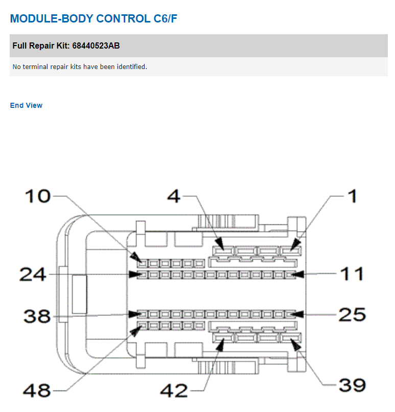

Tire Size
---------

.. note:: In models equipped with the advanced Park Sense module (not the basic, 4-sensor one) setting a bigger tire size **will cause Park Sense and ABS errors** and there is currently no known solution.

Generally, follow the default `Tire Size`_ procedure, and then:

	- if everything works fine after you restart the car, you're good to go
	- if you are getting an ABS error:
		- Run **ABS Initialization** adaptation
		- Run Advanced Scan and clear the error codes
		- Cycle the ignition (shut the car down, wait a moment, start it again)

SRT Mode vs Performance Pages
-----------------------------

If you want to enable SRT / Performance Pages on the radio, **don't use SRT Mode Adaptation.** This adaptation is used if you actually have an SRT hardware. To enable SRT options on the radio use Performance Pages adaptation, and be aware that the radio might need up to 24 hrs to catch up on changes made and/or a hard reset (pulling the radio fuse) if 24 hrs wait is not enough.

How to: Convert rear lamps on Grand Cherokee < 2014 from US to EU spec
----------------------------------------------------------------------

.. note:: This description is based on Wrangler JK process and might not be accurate. Inspect your vehicle wiring, diagrams and consult with someone who has some experience already. If the description is inaccurate, please reach out to us. Your feedback is highly appreciated.

1) Replace US rear lights with EU version

2) Set Combined Rear Lightning On/Off -> Set this option to Deactivated. 

This will leave only turn signals instead of combined lamps.

3) You will now need to add a wire from the third (center) stop light to the stop lights on the sides.

How to: Convert rear lamps on Grand Cherokee 2014-2020 from US to EU spec
-------------------------------------------------------------------------

General steps required to convert car to euro spec

Steps required to enable rear turn signals
^^^^^^^^^^^^^^^^^^^^^^^^^^^^^^^^^^^^^^^^^^

1) Combined Rear Lightning On/Off -> Set this option to Deactivated – this option will disable, brake with turn, only brake light will be available.
2) Check if Rear Turn Lamps Output Present -> Activated – this option will enable large pins C5/E pin number 3 & C6/F pin number 42 on BCM (Body Computer)
3) Right – Second Reverse Lamp – On/Off -> Set this option to Deactivated
4) Left – Second Reverse Lamp – On/Off -> Set this option to Deactivated
5) Replace white reverse bulbs with orange bulbs and conversion is completed

BCM diagram:

Plug / connector layouts:

Steps required to enable rear fog lights
^^^^^^^^^^^^^^^^^^^^^^^^^^^^^^^^^^^^^^^^

1) Rear Fog Lamps Output Present -> Activated – This option will activate two new pins on BCM C5/E pin number 39 & C6/F pin number 5:

Small pins “KOSTAL 1,2 MLK"
 
.. image:: ../img/wk2/SLK-12.png

2) Right – Rear Fog Lamp or High Beam Shutter On/Off -> Set to Activated
3) Left – Rear Fog Lamp or High Beam Shutter On/Off -> Set to Activated
4) Add wires to BCM C5/E pin number 39 & C6/F pin number 5
5) Connect wires to new rear fog lights
6) Fog lamp button should now work with double press

.. _Tire Size: https://jscan-docs.readthedocs.io/en/latest/general/tiresize.html