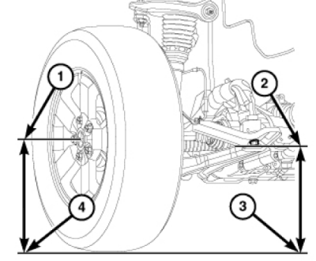
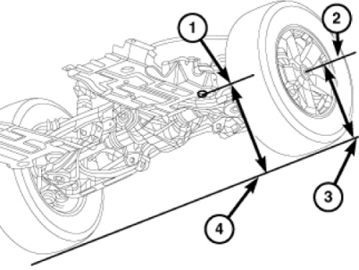
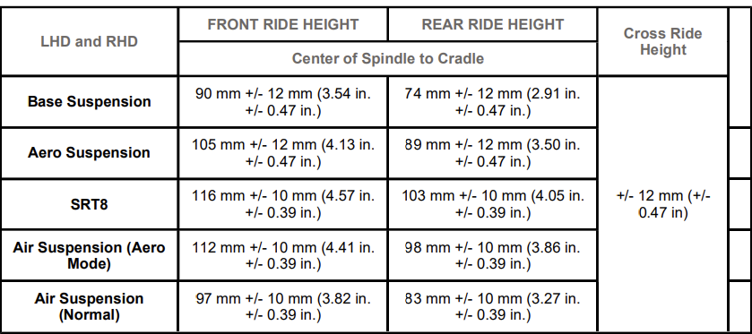

Choosing the correct adapter
============================

For WK2 2014+ an MS-CAN capable OBD adapter is required for full compatibility. See `Choosing the right adapter`_ in JL/JT section.

Bypassing the Security Gateway
==============================

Chrysler’s Secure Gateway Module came out in 2018. The SGW is a module whose function is simply to keep the communication networks secure. The SGW protects the vehicle networks from being exploited by creating a firewall between two portions of the network with the most vulnerability. This means, that to make any changes, you will need a SGW bypass - usually a cable. See our `SGW Bypass`_ page for details.

Tire Size
=========

.. note:: In models equipped with the advanced Park Sense module (not the basic, 4-sensor one) setting a bigger tire size **will cause Park Sense and ABS errors** and there is currently no known solution.

Generally, follow the default `Tire Size`_ procedure, and then:

	- if everything works fine after you restart the car, you're good to go
	- if you are getting an ABS error:
		- Run **ABS Initialization** adaptation
		- Run Advanced Scan and clear the error codes
		- Cycle the ignition (shut the car down, wait a moment, start it again)

SRT Mode vs Performance Pages
=============================

If you want to enable SRT / Performance Pages on the radio, **don't use SRT Mode Adaptation.** This adaptation is used if you actually have an SRT hardware. To enable SRT options on the radio use Performance Pages adaptation, and be aware that the radio might need up to 24 hrs to catch up on changes made and/or a hard reset (pulling the radio fuse) if 24 hrs wait is not enough.

How to: Convert rear lamps on Grand Cherokee < 2014 from US to EU spec
======================================================================

.. note:: This description is based on Wrangler JK process and might not be accurate. Inspect your vehicle wiring, diagrams and consult with someone who has some experience already. If the description is inaccurate, please reach out to us. Your feedback is highly appreciated.

* Replace US rear lights with EU version
* Set Combined Rear Lightning On/Off -> Set this option to Deactivated.
  This will leave only turn signals instead of combined lamps.
* You will now need to add a wire from the third (center) stop light to the stop lights on the sides.

How to: Convert rear lamps on Grand Cherokee 2014-2020 from US to EU spec
=========================================================================

General steps required to convert car to euro spec

Steps required to enable rear turn signals
------------------------------------------

* Combined Rear Lightning On/Off -> Set this option to Deactivated – this option will disable, brake with turn, only brake light will be available.
* Check if Rear Turn Lamps Output Present -> Activated – this option will enable large pins C5/E pin number 3 & C6/F pin number 42 on BCM (Body Computer).
	.. note:: In most vehicles the wiring harness will already have those pins properly wired. If the conversion doesn't work as expected, check the wiring first.
* Right – Second Reverse Lamp – On/Off -> Set this option to Deactivated
* Left – Second Reverse Lamp – On/Off -> Set this option to Deactivated
* Replace white reverse bulbs with orange bulbs and conversion is completed

BCM diagram:

.. image:: ../img/wk2/BCM.png
	:width: 400px

Plug / connector layouts:

.. image:: ../img/wk2/C5.png
	:width: 200px

.. image:: ../img/wk2/C6.png
	:width: 200px

Steps required to enable rear fog lights
----------------------------------------

1) Rear Fog Lamps Output Present -> Activated – This option will activate two new pins on BCM C5/E pin number 39 & C6/F pin number 5:

Small pins “KOSTAL 1,2 MLK"
 
.. image:: ../img/wk2/SLK-12.png

2) Right – Rear Fog Lamp or High Beam Shutter On/Off -> Set to Activated
3) Left – Rear Fog Lamp or High Beam Shutter On/Off -> Set to Activated
4) Add wires to BCM C5/E pin number 39 & C6/F pin number 5
5) Connect wires to new rear fog lights
6) Fog lamp button should now work with double press

Air Suspension - Calibration
================================

Vehicle height is to be checked with the vehicle on a flat, level surface, preferably a vehicle alignment rack. The 
tires are to be inflated to the recommended pressure. All tires are to be the same size as standard equipment. 
Vehicle height is checked with the fuel tank full of fuel, and no passenger or luggage compartment load.

HEIGHT MEASUREMENT - all values need to be measuered and enterd in milimiters "mm"

Front: 

Front Wheel Center Height – Measure the vertical 
distance between the front wheel center (1) and 
the ground (4), Record the measurement. 
2. Front Cradle Height – Measure the vertical 
distance between the center of the cradle bolt (2) 
to the ground (3), Record the measurement. 
3. Take the two measurements and subtract them to 
get the ride height.

Rear:

Rear Wheel Center Height – Measure the vertical 
distance between the wheel center (2) and 
the ground (3), Record the measurement. 
5. Rear Cradle Height – Measure the vertical 
distance between the center of the cradle bolt (1) 
to the ground (4), Record the measurement. 
6. Take the two measurements and subtract them to 
get the ride height. 

Reference Table:

Air Suspension (to be completed)
================================

Key notes:

DO NOT use the Leveling procedure instead of the terrain selector, as it puts the suspension in service mode.

Anything below 50mm for the rear will make the pump keep running forever.

Factory: WK2 - Trailhawk 2020

* Front Left = 90mm

* Front Right = 89mm

* Rear Left = 65mm

* Rear Right - 67mm

Lowered: WK2

* Front Left = 75mm

* Front Right = 74mm

* Rear Left = 50mm

* Rear Right - 52mm

The adjustment of the ride height can change the Normal Ride Height (NRH). The values of different modes (example below) cannot be changed. 

For example, for 2011 the basics of how the different automatic settings effect the systems are listed below:

* Auto - When in 4WD High range the vehicle height is at NRH. The vehicle systems are set to normal performance settings. Combines optimal traction with seamless steering feel. When in 4WD Low range the vehicle height adjusts to 38 mm (1.49 in.) above NRH, the transfer case locks, and the transmission shifting adjusts to off road shifting.

* Sport - When in 4WD High range the vehicle height adjusts to 15 mm (0.59 in.) below NRH. Electronic Stability Control (ESC) and traction control tuning thresholds are raised, and the Antilock Brake Control (ABS) allows less wheel slip, all to allow more driver control. Also the transmission shifting adjusts to a higher performance shifting. Not available in 4WD Low range .

* Snow - When in 4WD High range the vehicle height is at NRH. Traction control is adjusted to allow less wheel slip, and initial vehicle launch will be in second gear. When in 4WD Low range the vehicle height adjusts to 33 mm (1.3 in.) above NRH, the transfer case locks, the transmission shifting and ABS adjusts to off road settings.

* Sand/Mud - When in 4WD High range the vehicle height adjusts to 38 mm (1.49 in.) above NRH. Electronic Stability Control (ESC) tuning threshold is raised, and the ABS allows less wheel slip to allow more driver control. When in 4WD Low range the vehicle height adjusts to 38 mm (1.49 in.) above NRH. The transfer case and the Electronic Limited Slip Differential (ELSD) locks, the transmission shifting and ABS adjusts to off road settings.

* Rock - Not available in 4WD High range . When in 4WD Low range the vehicle height adjusts to 65 mm (2.6 in.) above NRH. The transfer case and the ELSD locks, the transmission shifting and ABS adjusts to off road settings, and hill descent control is activated for steep downhill control.

Air suspension delete
===============================================

.. note:: For pre-lift (up to 2014) models:

If you're removing the air suspnesion and replacing it with regular coilovers, follow the steps below (as always: it is YOUR responsibility and we take no liability for any damages)

1) Eemove the 2 fuses related to the air suspension and also the relay located in the relay box beside de fuse panel
2) Disable the air suspension module control with Jscan.

	- Adaptation > Modules Configuration > ASCM - Air Suspension Control On/Off > set to Deactivated

3) Unhook the module itself located under the driver seat.
4) Disconnect the negative terminal of the main battery for 30 seconds and reconnect it to get rid of the message and the blinking buttons.
5) If you get ABS errors, run ABS initialization procedure.

.. _Tire Size: https://jscan-docs.readthedocs.io/en/latest/general/tiresize.html

WK2 - 2014+ - HID Lamps configuration
===============================================
- High Intensity Discharge Head Lamps -> Set
- Low Beam Output or Low Beam Output Present -> Not Set (This param may not exist on some models)
- Bi-Xenon Headlamps -> Set
- LED Front Turn Lamps -> Set
- LED Dedicated DRL -> Set
- LED Front Park / Marker Lamps -> Set
- Left High Beam Voltage -> 13.0 Volts
- Right High Beam Voltage -> 13.0 Volts
- IOD RELAY OFF HSD Present / Relay OFF High Side Down Present  -> Set
- IOD RELAY ON HSD Present / Relay ON High Side Down Present -> Set

- Ignition-OffDraw (IOD) OFF HSD output -> Set (This param may not exist on some models)
- Ignition-Off Draw (IOD) ON HSD output -> Set (This param may not exist on some models)
- IOD RELAY ON HSD Usage Left HID Lamp -> WK (This param may not exist on some models)
- IOD RELAY OFF HSD Usage -> Right HID Lamp - WK (This param may not exist on some models)

- Right Dedicated DRL Output -> Set
- Left Dedicated DRL Output -> Set
- DRL Lamps Location -> Dedicated
- DRL Dropout -> Set
- Left DRL Voltage -> 7.4 Volts
- Right DRL Voltage -> 7.4 Volts
- Front Driver Door Ajar Switch Signal Usage -> Left Front La Diagnostics (Jeep/RAM)
- Front Passenger Door Ajar Switch Signal Usage -> Right Front Lamp Diagnostics (Jeep/RAM)

If it still dosen't work search for params related to HSD

.. image:: ../img/wk2/WK2_LIFT_HID.png
	:width: 200px

Remote Start Enable
===============================================

.. note:: For pre-lift (up to 2014) models:
Remote Start Activation – Jeep Grand Cherokee WK2

Module: Front Control Module (FCM) Configuration
- Remote Start Present → SET
- Reconfig Input 2 (B11) → Hood Ajar
- (Important: the hood ajar sensor must use a 1 kΩ resistor)

Cycle ignition OFF → ON → OFF

Key Programming
- Read PIN
- Program new key with the Remote Start button

Cycle ignition OFF → ON → OFF

WCM / RF-Hub Procedures
- Run WCM – Replace procedure
- If required (vehicles with Keyless Go), run WCM – Reset WIN

Cycle ignition OFF → ON → OFF

Final Steps
- Perform a short test drive – exceed 50 km/h to allow module synchronization
- Park, lock the vehicle, and double-press the Remote Start button on the key fob to verify operation

.. list-table::
   :widths: 50 50
   :align: center

   * - .. image:: ../img/wk2/wk2-key-remote-start.jpg
         :width: 80%

         *Key with Remote Start*
     - .. image:: ../img/wk2/wk2-hood-pin.jpg
         :width: 80%

         *Hood Ajar Sensor – 1 kΩ resistor*
   * - .. image:: ../img/wk2/wk2-remote-start-present.jpg
         :width: 80%

         *Remote Start Present → Set (Active)*
     - .. image:: ../img/wk2/wk2-reconfig-input-b11.jpg
         :width: 80%

         *Hood Ajar Input (B11) configuration*

